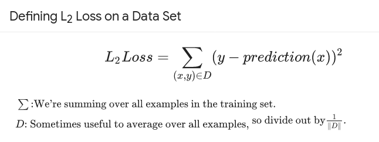
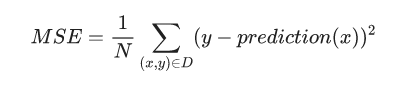
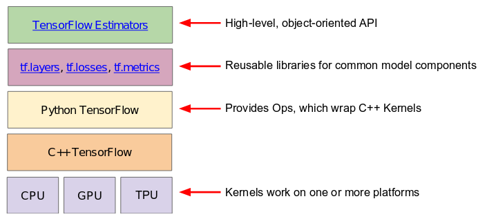

## Intro
My experiences with the TensorFlow crash course.  I've collected the python code
for this class in the code directory of this repo.  There are
_**Jupyter Notebooks**_ for these as well in the notebooks directory.

https://developers.google.com/machine-learning/crash-course/

From an
[Infoworld article](https://www.infoworld.com/article/3278008/machine-learning/what-is-tensorflow-the-machine-learning-library-explained.html)
I found:

_**TensorFlow allows developers to create dataflow graphs—structures that
describe how data moves through a graph, or a series of processing nodes. Each
node in the graph represents a mathematical operation, and each connection or
edge between nodes is a multidimensional data array, or tensor.**_

So _tensors_ are sets of data that _flow_ through the compute graph.

## Sessions
Here my notes on the course sessions/chapters.

-----

### Framing
**Regression model** predicts continuous values
**Classification model** predicts discrete values

-----

### Descending into ML
When talking about a simple linear regression, might use _**y = mx + b**_.  in
Machine learning it's _**y = wx + b**_
- **w** represents weights instead of slope
- **b** represents bias instead of Y intercept

**Loss** is the error between prediction and actual

 

Useful loss function is squared error:
 

When training a model, want to minimize loss across all training examples:
 

Goal is to minimize loss by finding the right set of weights and biases
on average, across all examples:
 

**Mean Squared Error (MSE)** id the average squared loss per example over the
whole dataset.
 

MSE is commonly used in ML, but it isn't the only practical, or even the best
loss function in all cases.

-----

### Reducing Loss
**Hyperparameters** - config settings use to tune the model during training

The derivative of the loss function (L2 loss here) with respect to the weights
and biases tells us how the loss changes for a given example
- Simple to compute, and is a convex function

Repeatedly take small steps in the direction that minimizes loss
- Negative gradient steps
- This strategy is **gradient descent**

**Learning rate** is a hyperparameter that determines how large of a step to
take in the direction of the negative gradient to minimize loss.
- This strategy is **gradient descent**

 

If choose too large of a step, the model can diverge, and never minimize the
loss function.  In this case, reduce the step size by a large value and re-try.

A gradient descent **batch** is the group of examples used to calculate the
gradient in a single iteration.  Batches can be the size of the entire dataset,
but they can be a subset to reduce compute time.

**Stochastic Gradient Descent (SGD)** chooses one example from the dataset at random
per iteration to calculate the gradient.  This is very noisy, but does eventually
work, given enough iterations.

**Mini-batch SGD** is a compromise where typically between 10 and 1000 examples
are chosen at random from the full dataset for gradient calculation.  This
balances noise and efficiency of calculation.

-----

### First Steps with TF

TensorFlow consists of 2 components:
- A graph protocol buffer
- A runtime that executes the graph

tf.estimator is the high level API that the crash course is based on.
tf.estimator is compatible with the Scikit-learn ML library.

#### Programming exercises
See the _**intro_to_pandas**_ notebook for lesson and exercises.

[Intro to Pandas API](./crash_course/notebooks/intro_to_pandas.ipynb) 
[Pandas documentation](http://pandas.pydata.org/pandas-docs/stable/index.html)

- Pandas is a column-oriented data analysis API
- Dataframe - a relational table
- Series - a single column.  A dataframe contains one or more series, and
  a name for each series
- Use the _**describe**_ method to show details of a dataframe

See the _**first_steps_with_tensor_flow**_ notebook for lesson and exercises

2 types of data

-----

-----

### References
