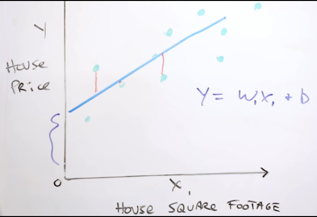
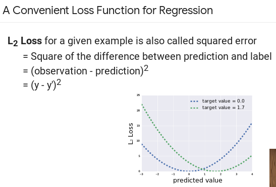
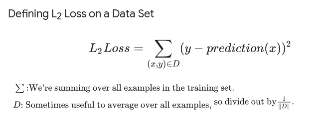
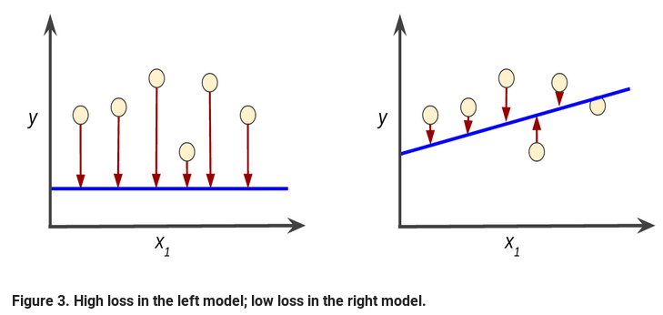
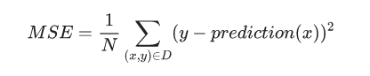
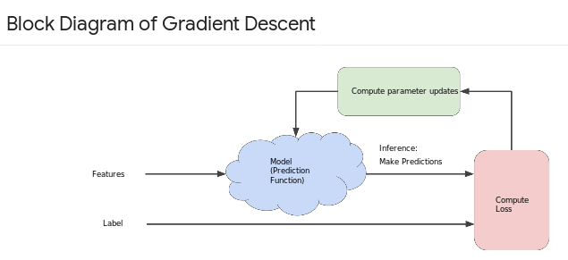
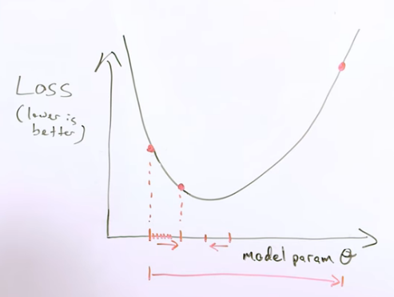
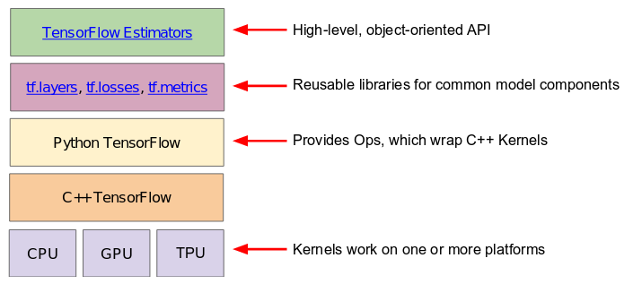
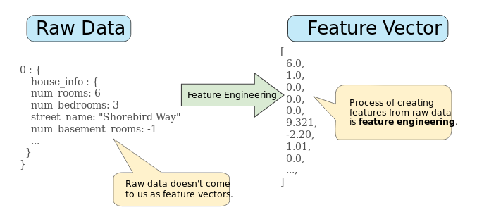

## Intro
My experiences with the TensorFlow crash course.  I've collected the python code
for this class in the code directory of this repo.  There are
_**Jupyter Notebooks**_ for these as well in the notebooks directory.

https://developers.google.com/machine-learning/crash-course/

From an
[Infoworld article](https://www.infoworld.com/article/3278008/machine-learning/what-is-tensorflow-the-machine-learning-library-explained.html)
I found:

_**TensorFlow allows developers to create dataflow graphs—structures that
describe how data moves through a graph, or a series of processing nodes. Each
node in the graph represents a mathematical operation, and each connection or
edge between nodes is a multidimensional data array, or tensor.**_

So _tensors_ are sets of data that _flow_ through the compute graph.

## Sessions
Here my notes on the course sessions/chapters.

-----

### Framing
**Regression model** predicts continuous values
**Classification model** predicts discrete values

-----

### Descending into ML
When talking about a simple linear regression, might use _**y = mx + b**_.  in
Machine learning it's _**y = wx + b**_
- **w** represents weights instead of slope
- **b** represents bias instead of Y intercept

**Loss** is the error between prediction and actual

 

Useful loss function is squared error:
 

When training a model, want to minimize loss across all training examples:
 

Goal is to minimize loss by finding the right set of weights and biases
on average, across all examples:
 

**Mean Squared Error (MSE)** id the average squared loss per example over the
whole dataset.
 

MSE is commonly used in ML, but it isn't the only practical, or even the best
loss function in all cases.

-----

### Reducing Loss
**Hyperparameters** - config settings use to tune the model during training

The derivative of the loss function (L2 loss here) with respect to the weights
and biases tells us how the loss changes for a given example
- Simple to compute, and is a convex function

Repeatedly take small steps in the direction that minimizes loss
- Negative gradient steps
- This strategy is **gradient descent**

**Learning rate** is a hyperparameter that determines how large of a step to
take in the direction of the negative gradient to minimize loss.
- This strategy is **gradient descent**

 

If choose too large of a step, the model can diverge, and never minimize the
loss function.  In this case, reduce the step size by a large value and re-try.

A gradient descent **batch** is the group of examples used to calculate the
gradient in a single iteration.  Batches can be the size of the entire dataset,
but they can be a subset to reduce compute time.

**Stochastic Gradient Descent (SGD)** chooses one example from the dataset at random
per iteration to calculate the gradient.  This is very noisy, but does eventually
work, given enough iterations.

**Mini-batch SGD** is a compromise where typically between 10 and 1000 examples
are chosen at random from the full dataset for gradient calculation.  This
balances noise and efficiency of calculation.

-----

### First Steps with TF

TensorFlow consists of 2 components:
- A graph protocol buffer
- A runtime that executes the graph

tf.estimator is the high level API that the crash course is based on.
tf.estimator is compatible with the Scikit-learn ML library.

#### Programming exercises
See the _**intro_to_pandas**_ notebook for lesson and exercises.

[Intro to Pandas API](./notebooks/intro_to_pandas.ipynb) 
[Pandas documentation](http://pandas.pydata.org/pandas-docs/stable/index.html)

- Pandas is a column-oriented data analysis API
- Dataframe - a relational table
- Series - a single column.  A dataframe contains one or more series, and
  a name for each series
- Use the _**describe**_ method to show details of a dataframe

See the _**first_steps_with_tensor_flow**_ notebook for lesson and exercises.

2 types of data:
- _**categorical**_ - textual data
- _**numerical**_ - data that is a number

Usually look at Root Mean Squared Error (RMSE) rather than Mean Squared Error
(MSE), since RMSE can be judged on the same scale as the original targets.

See the _**synthetic_features_and_outliers**_ notebook for lesson and exercises.

Common Hyperparameters
- _**steps**_ - total number of training iterations.  One step calculates the loss
  from one batch and uses that value to modify the model's weights once.
- _**batch size**_ - number of examples, chosen at random for a single step.

Total number of trained examples == batch size * steps

An _**epoch**_ is a full training run across the total number of trained examples.

Convenience variable
A _**period**_ is a grouping of training steps, used to observe model improvement
during training.  This is a convenience variable to control the
granularity of reporting.  This is not a hyperparameter.  It doesn't alter what
the model learns.

-----

### Generalization
_**Goal**_ - predict well on new data drawn from a hidden, true distribution
_**Problem**_ - we don't see the truth, we only get to sample it

I model h predicts well on our current samples, how can be sure that it will do
well on new samples?

_**Empirical**_ - evaluate the model against a new draw of test data

Assumptions:
- We draw samples _**independently and empirically (i.i.d)**_ at random from the
  distribution.
- The distribution is _**stationary**_ - doesn't change over time.
- We always pull from the same distribution, including training, validation,
  and test sets.

Overfit models will have low loss, but don't generalize to new data well.

Overtiffing is caused by making the model more complicated than necessary.
- Fundamental tension of machine learning is balancing  the need to fit data
  well, but as simply as possible.

Ockam's razor applies here.
- William of Ockam - 14th century friar and philosopher

Separate data into training and test sets.  Keys:
- Test set is large enough
- Don't cheat by using the same test repeatedly

-----

### Training and Test Sets
- When splitting training from test data, good idea to randomize first to avoid
  getting clumps of data in one set or the other.
- How big to make each set?
   - Larger training set - better we can learn
   - Larger test set - better confidence in the results
- Don't ever train on test data - will give unrealistically good results
   - If ever get 100% accuracy, check that you didn't accidentally train on the
    wrong data set, or there are things like lots of duplicate data points
    between the test and training sets.
- Always want to make sure that yout _**test**_ set is:
   - Large enough to yield statistically meaningful results
   - Is representative of the test set as a whole.  Don't pick a test set with
     different characteristics than the training set.

-----

### Validation
If iterate through hyperparameter tuning in the training set to make the test
set accuracy good, may be overfitting to peculiarities of the data.  May want to
partition the original data set into 3 to include a new validation set.
- Train on training data
- Validate on validation data, keeping the final test data separate

Pick a model/set of tuning parameters that works best on validation, confirm
results on the test data.
- If results between testing on validation and test data sets differ, then
  probably were overfitting the validation set.

Validation set is like a second test set.

-----

### Representation
Date from the real world doesn't come to us as feature vectors we can use.
Instead is database records, protocol buffers, etc.

Need to create feature vectors from heterogeneous data sources
- Feature engineering - engineers spend ~ 75% of their time on this
- Can use one-hot encoding
   - Unique coefficient for each string of input we see
   - Binary 0/1 value for each unique example value (e.g. street address)
      - This can be represented compactly

Good feature characteristics
- Should occur at least a handful of times in the feature set
   - Features that only occur once, or **very** rarely should probably be
     filtered out during data pre-processing
- Should not take on magic values
   - e.g. a feature for number of days a house is on the market should not have
     a special value of **-1** to indicate that the house had never been on the
     market.  Us a special boolean value to indicate this.
- Feature values shouldn't change over time
- Should not have crazy outlier values
   - Cap or transform features to get rid of outliers
- Binning trick -
   - Use one-hot encoding to create bins of similar features
   - Boolean value indicates membership in the bin
- Good habits
   - Visualize the data (explore)
   - Make everything clean (remove outliers ...)
   - Monitor data over time

#### Mapping Raw Data to Features
- Many ML models represent features as real-valued numbers, since they must
  be multiplied by model weights

- Integer and floating-point values can be copied over directly
- Categorical features have a discrete set of possible values
   - Map values to integers
      - Since multiplying by weights, a simple set of integers will imply an order
        or magnitude to the values they represent (eg. street addresses)
      - Some objects with the feature may have multiple values
   - Create a binary vector for each categorical feature rather than an ordered
     integer value
      - For values that apply to the object, value is one
      - Zero for objects where the value doesn't apply to the object
   - Length of this vector == number of elements in the vocabulary
      - If 10 values in the street category, 10-bit vector
   - For categories with very large numbers of values, use a
     _**sparse representation**_, where only non-zero values are stored

-----

-----

### References
